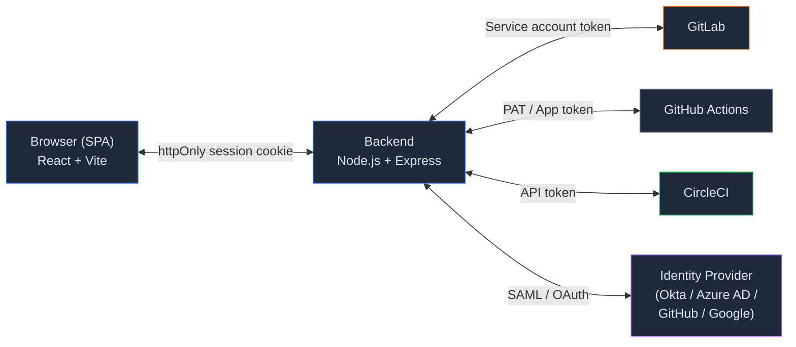
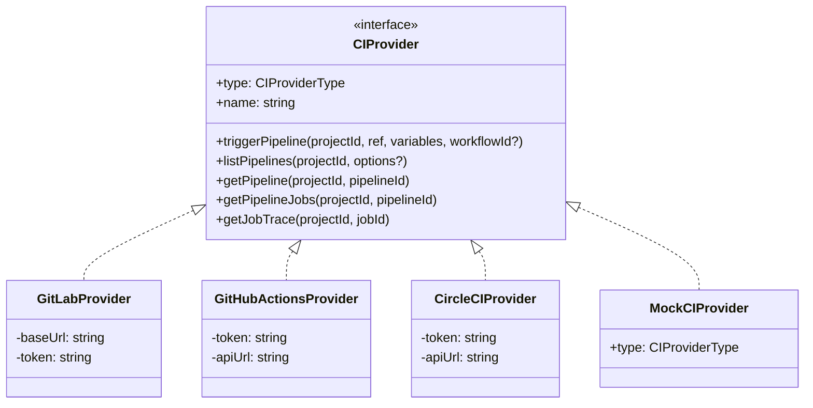
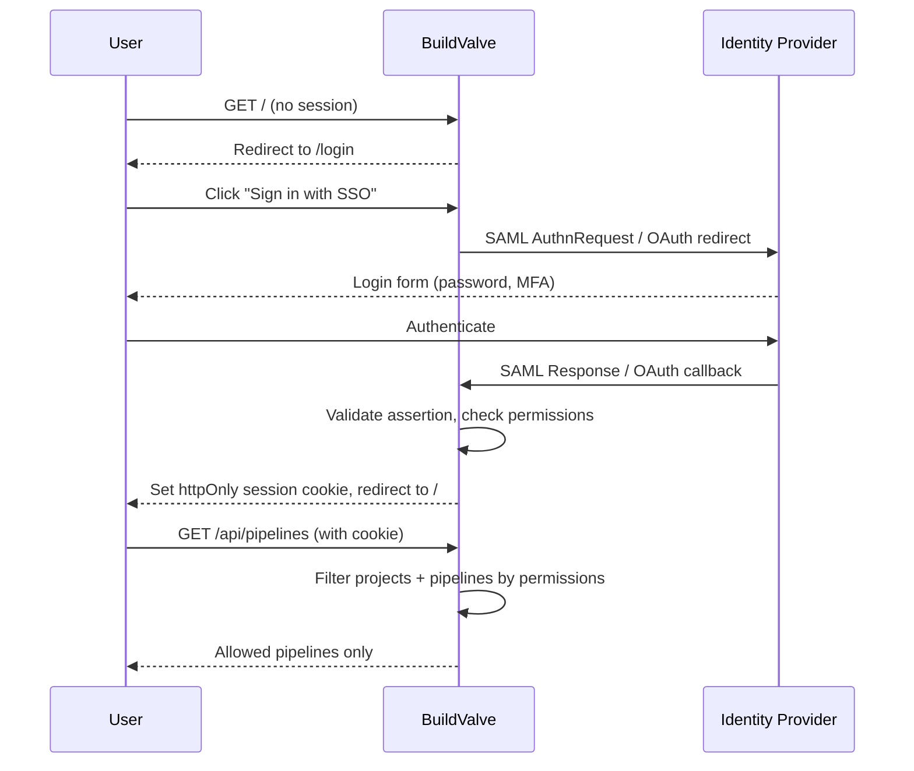
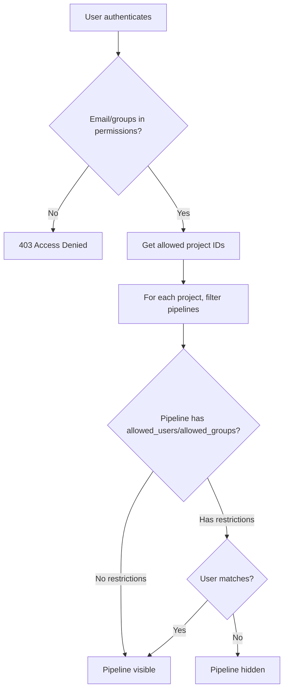
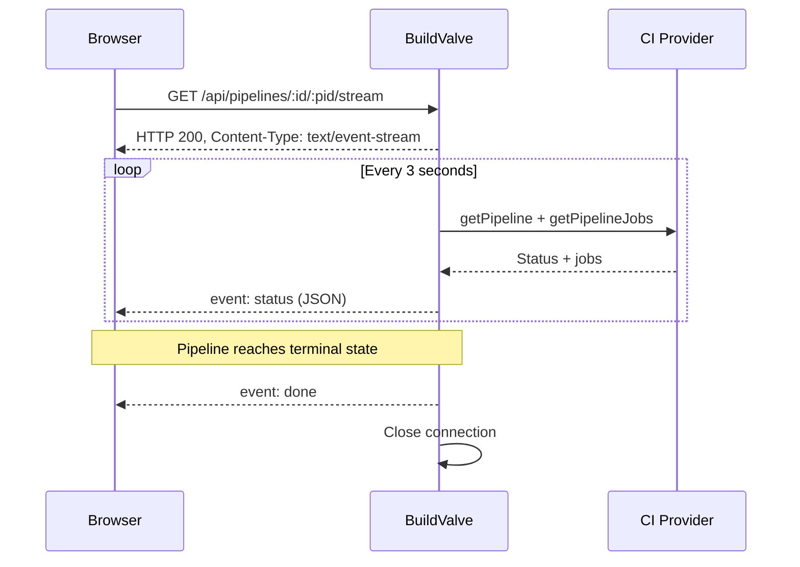

# BuildValve — Architecture

## Overview

BuildValve is a stateless, config-driven CI/CD pipeline launcher. It acts as a controlled proxy between end users and multiple CI/CD providers (GitLab, GitHub Actions, CircleCI). The application has no persistent database; all state lives in the YAML config file (pipeline definitions) or in the CI providers themselves (pipeline execution state).

---

## System Diagram



- **Frontend (SPA)**: Renders the launcher UI from server-provided config. Never talks to CI providers directly.
- **Backend**: Validates identity (SAML/OAuth), enforces authorization (config + per-pipeline permissions), and relays pipeline commands to CI providers using service account tokens.
- **CI Providers**: Only touched by service account tokens. End users do not need accounts on any CI platform.

---

## CI Provider Architecture



All providers return normalized `CIPipeline` and `CIJob` types. Status values are normalized across providers to: `running`, `success`, `failed`, `pending`, `canceled`.

---

## Auth Flow



### AuthProvider Interface

```typescript
interface AuthUser {
  email: string           // canonical identity across all providers
  provider: string        // "saml" | "github" | "google" | "gitlab" | "local" | "mock"
  groups?: string[]
}

interface AuthProvider {
  type: string
  label: string
  setupRoutes(router: Router): void
}
```

### Email as Canonical Identity

Permissions are matched by **email address**, not username. This ensures provider-agnostic authorization — a user logging in via SAML, GitHub OAuth, or local accounts resolves to the same permissions if the email matches.

---

## Permission Model



Two layers of authorization:
1. **Project-level**: `permissions[]` in config maps users/groups to project IDs
2. **Pipeline-level**: Optional `allowed_users`/`allowed_groups` on individual pipelines restrict access within a project

---

## Real-Time Updates (SSE)



The frontend uses `EventSource` (SSE) instead of polling for:
- **Pipeline status + jobs** — `GET /api/pipelines/:projectId/:pipelineId/stream`
- **Job log streaming** — `GET /api/pipelines/:projectId/jobs/:jobId/trace/stream`

SSE was chosen over WebSocket because the data flow is one-way (server to client), it works through corporate proxies, requires no extra dependencies, and browsers auto-reconnect on disconnect.

---

## Audit Logging

All user actions are logged as structured JSON to stdout (and `logs/audit.log`):

```json
{
  "audit": true,
  "event": "pipeline_triggered",
  "user_email": "alice@company.com",
  "user_provider": "saml",
  "project_id": "42",
  "provider": "gitlab",
  "pipeline_name": "Deploy to Production",
  "ci_pipeline_id": "12345",
  "timestamp": "2026-03-19T10:30:00.000Z"
}
```

Events: `login`, `login_failed`, `logout`, `pipeline_triggered`, `pipeline_trigger_failed`, `pipeline_viewed`, `pipeline_history_viewed`, `job_logs_viewed`, `admin_config_viewed`.

---

## File Structure

```
buildvalve/
├── config/
│   └── config.yml              # gitignored — user configuration
├── server/
│   └── src/
│       ├── index.ts            # Express app entry point
│       ├── config.ts           # YAML loader + AJV schema validation
│       ├── routes/
│       │   ├── auth.ts         # Login/callback/logout/me
│       │   ├── pipelines.ts    # Pipeline CRUD + trigger + history + logs + SSE
│       │   └── admin.ts        # Config inspection (redacted) — admins only
│       ├── middleware/
│       │   ├── requireAuth.ts  # Session guard
│       │   └── session.ts      # express-session setup
│       ├── services/
│       │   ├── auth/
│       │   │   ├── index.ts        # Auth provider registry
│       │   │   ├── saml-provider.ts
│       │   │   ├── oauth-provider.ts
│       │   │   ├── local-provider.ts
│       │   │   ├── mock-provider.ts
│       │   │   └── types.ts
│       │   ├── ci/
│       │   │   ├── index.ts             # CI provider registry
│       │   │   ├── types.ts             # CIProvider interface, CIPipeline, CIJob
│       │   │   ├── gitlab-provider.ts
│       │   │   ├── github-actions-provider.ts
│       │   │   ├── circleci-provider.ts
│       │   │   └── mock-provider.ts
│       │   └── permissions.ts      # Project + pipeline authorization
│       ├── types/
│       │   └── index.ts            # AppConfig, ProjectConfig, PipelineConfig, etc.
│       └── utils/
│           ├── logger.ts           # Winston logger (stdout + file)
│           └── audit.ts            # Structured audit event helper
├── client/
│   └── src/
│       ├── App.tsx             # Router + route definitions
│       ├── api/
│       │   ├── client.ts       # fetchApi wrapper + ApiError
│       │   ├── queries.ts      # pipelinesApi, authApi, adminApi
│       │   └── types.ts        # CIPipeline, CIJobDetail, etc.
│       ├── hooks/
│       │   └── useSSE.ts       # SSE hook, usePipelineStream, useLogStream
│       ├── components/
│       │   ├── layout/
│       │   │   └── AppShell.tsx    # Sidebar nav, auth guard, layout
│       │   └── ui/                 # Shadcn/ui components + ProviderBadge
│       ├── contexts/
│       │   └── AuthContext.tsx     # User session state
│       └── pages/
│           ├── LoginPage.tsx
│           ├── PipelinesPage.tsx       # Project/pipeline table with provider badges
│           ├── PipelineLaunchPage.tsx  # Variable form + trigger
│           ├── PipelineRunPage.tsx     # Live run status + jobs (SSE)
│           ├── PipelineLogsPage.tsx    # Full-screen live log stream (SSE)
│           ├── PipelineHistoryPage.tsx # Execution history for a ref
│           ├── ProfilePage.tsx
│           └── AdminConfigPage.tsx     # Rendered config.yml (admins only)
├── package.json                # Workspace root
├── README.md
└── ARCHITECTURE.md
```

---

## API Endpoints

### Auth

| Method | Path | Description |
|--------|------|-------------|
| GET | `/api/auth/providers` | Returns list of enabled auth providers for the login page |
| GET | `/api/auth/:provider/login` | Redirect to IdP / OAuth authorize |
| POST | `/api/auth/saml/callback` | ACS — receive SAML assertion, create session |
| GET | `/api/auth/saml/metadata` | SAML SP metadata XML |
| POST | `/api/auth/logout` | Destroy session |
| GET | `/api/auth/me` | Current user + allowed projects (filtered by pipeline permissions) |

### Pipelines

| Method | Path | Description |
|--------|------|-------------|
| GET | `/api/pipelines` | User's allowed pipeline configs (filtered by pipeline permissions) |
| POST | `/api/pipelines/trigger` | Trigger a pipeline (validates vars + project + pipeline perms) |
| GET | `/api/pipelines/recent` | Recent pipelines for user's projects (LRU cached, 10s TTL) |
| GET | `/api/pipelines/:projectId/history?ref=` | Pipeline execution history for a ref |
| GET | `/api/pipelines/:projectId/:pipelineId` | Single pipeline + jobs |
| GET | `/api/pipelines/:projectId/jobs/:jobId/trace` | Raw job log text |
| GET | `/api/pipelines/:projectId/:pipelineId/stream` | **SSE** — real-time pipeline status + jobs |
| GET | `/api/pipelines/:projectId/jobs/:jobId/trace/stream` | **SSE** — real-time job log streaming |

### Admin

| Method | Path | Description |
|--------|------|-------------|
| GET | `/api/admin/config` | Loaded config with tokens redacted (admins only) |

---

## Frontend Routing

| Route | Component | Description |
|-------|-----------|-------------|
| `/login` | `LoginPage` | SSO / OAuth / local login |
| `/` | `PipelinesPage` | All allowed projects + pipeline table |
| `/project/:id/pipeline/:name` | `PipelineLaunchPage` | Variable form + Launch button |
| `/project/:id/pipeline/:name/run/:runId` | `PipelineRunPage` | Live pipeline status + jobs (SSE) |
| `/project/:id/pipeline/:name/run/:runId/job/:jobId/logs` | `PipelineLogsPage` | Full-screen live job log stream (SSE) |
| `/project/:id/pipeline/:name/history` | `PipelineHistoryPage` | Execution history |
| `/profile` | `ProfilePage` | Logged-in user info |
| `/admin` | `AdminConfigPage` | Config viewer (admins only) |

---

## Key Design Decisions

### Stateless Backend
No database. Pipeline history is fetched live from CI providers on demand. The only server-side state is the in-memory LRU cache for recent pipelines (10s TTL) to avoid hammering provider APIs on dashboard load.

### CI Provider Abstraction
All CI providers implement the `CIProvider` interface. The pipeline router resolves the provider per-project at request time. This allows mixing providers on the same dashboard and adding new providers without touching routes.

### Mock CI Provider
`MockCIProvider` implements the `CIProvider` interface for all three provider types with in-memory state. Enabled via `mock: true` on any provider in config. Pipelines auto-complete after 15 seconds. Cleared on server restart.

### Two-Layer Permission Model
Project-level permissions (`permissions[]`) control which projects a user can see. Pipeline-level restrictions (`allowed_users`/`allowed_groups`) further restrict individual pipelines within an allowed project. Both layers are checked on every API call.

### Variable Locking
`locked: true` variables are never sent to the client; they are injected server-side. Users cannot observe or override them. This is the primary security control for gating pipeline behaviour.

### SSE over WebSocket
Server-Sent Events were chosen over WebSocket because the data flow is strictly server-to-client (status updates, log streaming). SSE works through corporate proxies without special configuration, requires no extra dependencies, and browsers auto-reconnect on disconnect.

### Route Ordering (Express)
The `/api/pipelines/:projectId/history` route is registered **before** `/api/pipelines/:projectId/:pipelineId` to prevent Express interpreting the literal string `"history"` as a `:pipelineId` param. SSE `/stream` routes are registered after regular routes.

### Version Injection
`__APP_VERSION__` is a build-time constant injected by Vite from `client/package.json`. No runtime overhead; it is replaced by the literal string at build time.

---

## Tech Stack

| Layer | Technology |
|-------|------------|
| Frontend | React 19 + TypeScript + Vite |
| UI Components | Shadcn/ui + Tailwind CSS 3 |
| Data fetching | TanStack Query v5 + SSE (EventSource) |
| Routing | React Router v7 |
| Backend | Node.js 22 + Express |
| Auth | SAML 2.0, OAuth 2.0 (GitHub, Google, GitLab), Local |
| CI Providers | GitLab API v4, GitHub Actions API, CircleCI API v2 |
| Config | YAML (`js-yaml`) + AJV schema validation |
| Sessions | `express-session` (SQLite / Redis) |
| Caching | LRU Cache (recent pipelines) |
| Logging | Winston (stdout + file) |
