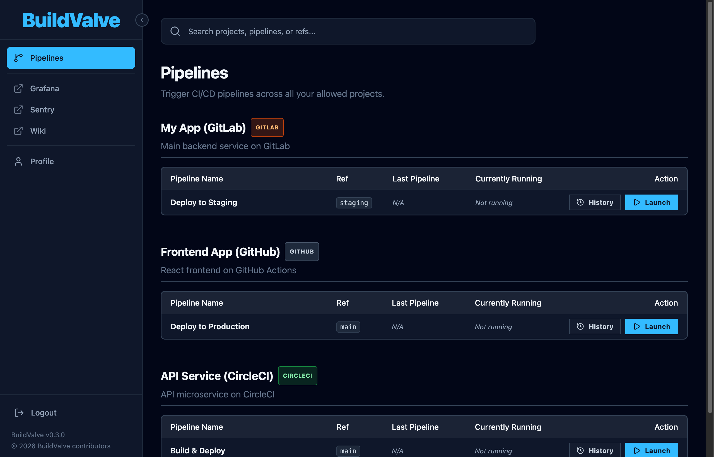

# BuildValve

[](https://github.com/cergfix/buildvalve/actions/workflows/ci.yml)

**A self-hosted, team-friendly CI/CD pipeline launcher.**



BuildValve lets you give your team a simple dashboard of big "Launch" buttons for their CI/CD pipelines across **GitLab**, **GitHub Actions**, and **CircleCI** — without handing out direct access, exposing raw CI variables, or forcing everyone to learn each provider's UI.

You configure which pipelines are available and who can trigger them. Your team logs in via your company's SSO and simply clicks **Launch**.

---

## Why BuildValve?

- **Multi-provider** — GitLab, GitHub Actions, and CircleCI projects on the same dashboard.
- **No CI accounts needed for users** — service account tokens handle all API calls.
- **Per-pipeline permissions** — restrict sensitive pipelines to specific users or groups.
- **Safe variable pre-filling** — lock sensitive variables server-side so users can't override them.
- **Audit-ready** — structured JSON access logs to stdout for every user action (login, trigger, view, admin).
- **SSO-native** — integrates with SAML 2.0, GitHub OAuth, Google OAuth, GitLab OAuth, or local accounts.
- **Live monitoring** — SSE-powered real-time pipeline status and live job log streaming.

---

## Quick Start with Docker

The fastest way to run BuildValve. No Node.js installation required.

**1. Create a config file** (`config.yml`):

```yaml
ci_providers:
  - name: gitlab-corp
    type: gitlab
    url: https://gitlab.example.com
    token: glpat-xxxxxxxxxxxx

auth:
  providers:
    - type: saml
      enabled: true
      label: "Company SSO"
      entry_point: https://idp.example.com/sso/saml
      issuer: https://buildvalve.example.com
      callback_url: https://buildvalve.example.com/api/auth/saml/callback
      cert: |
        MIICpDCCAYwCCQDU+pQ4pHgSp...

session:
  secret: change-this-to-a-long-random-string
  max_age: 28800

permissions:
  - groups: [devops-team]
    projects: ["42"]

projects:
  - id: "42"
    name: "My App"
    provider: gitlab-corp
    external_id: "42"
    pipelines:
      - name: "Deploy"
        ref: main
        variables: []
```

See the full [Configuration](#configuration) section below for all options.

**2. Create a `Dockerfile`** that extends the base image:

```dockerfile
FROM ghcr.io/cergfix/buildvalve:latest
COPY config.yml /app/config/config.yml
```

**3. Build and run:**

```bash
docker build -t my-buildvalve .
docker run -d -p 3000:3000 my-buildvalve
```

Open **http://localhost:3000** and you're done.

---

## Try It Locally (no config needed)

A ready-made dev config with mock auth and mock CI providers is included in the `dev/` directory. One command to go from zero to a running dashboard:

```bash
./dev/start.sh
```

This builds a derived Docker image from `dev/Dockerfile` (which copies `dev/config.yml` into the base image) and runs it with:
- **Mock auth** — click "Bypass Login (Dev)" to sign in as `bob@company.com`
- **Mock CI providers** — pipeline triggers are simulated in-memory and auto-complete after ~15 seconds
- **Three providers configured** — GitLab, GitHub Actions, and CircleCI mock projects

Open **http://localhost:3000** and click the login button.

> You can edit `dev/config.yml` to add more projects or change the mock user — re-run `./dev/start.sh` to rebuild.

---

## Build from Source

### Requirements

- **Node.js** >= 22 (use `nvm use` if you have [nvm](https://github.com/nvm-sh/nvm) installed — a `.nvmrc` is included)
- A **CI provider service account token** for the providers you want to use
- A **SAML 2.0 IdP** for production use (Okta, Azure AD, Keycloak, ADFS)

### 1. Clone and install

```bash
git clone https://github.com/cergfix/buildvalve.git
cd buildvalve
npm install
```

### 2. Configure

Create a `config/config.yml` file (it's gitignored — never commit it):

```bash
cp dev/config.yml config/config.yml
```

Edit `config/config.yml` with your values — see the [Configuration](#configuration) section below.

### 3. Run in development

```bash
# Start the backend (port 3000)
cd server && npm run dev

# In a second terminal — start the frontend (port 5173)
cd client && npm run dev
```

Open **http://localhost:5173** in your browser. The frontend dev server automatically proxies all `/api/*` requests to the backend.

### 4. Run in production

```bash
# Build the frontend
cd client && npm run build

# The backend serves the built SPA automatically
cd ../server && npm start
```

Set `NODE_ENV=production` in your environment to enable secure (HTTPS-only) session cookies.

### 5. Build a Docker image locally

```bash
docker build -t buildvalve .
```

Then create a derived image with your config (see [Quick Start with Docker](#quick-start-with-docker)) or set `CONFIG_PATH` in your environment for local testing.

---

## Deployment Options

BuildValve publishes three Docker images on each release:

| Image | Description | Use case |
|-------|-------------|----------|
| `ghcr.io/cergfix/buildvalve` | Combined server + client SPA | Default — simplest deployment |
| `ghcr.io/cergfix/buildvalve-server` | API server only (no static files) | Separate API backend |
| `ghcr.io/cergfix/buildvalve-client` | Client SPA on nginx | CDN / separate frontend hosting |

### Combined (default)

Server and client in one container. This is the simplest approach:

```bash
docker run -d -p 3000:3000 -v ./config.yml:/app/config/config.yml:ro ghcr.io/cergfix/buildvalve:latest
```

### Split deployment (API + CDN)

For deploying the client on a CDN and the server as a separate API:

**1. Build the client with `VITE_API_URL`:**

```bash
# Using the client Docker image
docker build --build-arg VITE_API_URL=https://api.buildvalve.example.com -f Dockerfile.client -t my-buildvalve-client .

# Or build from source
VITE_API_URL=https://api.buildvalve.example.com npm run build --workspace=client
```

**2. Run the API server:**

```bash
docker run -d -p 3000:3000 \
  -e CORS_ORIGIN=https://buildvalve.example.com \
  -v ./config.yml:/app/config/config.yml:ro \
  ghcr.io/cergfix/buildvalve-server:latest
```

**3. Serve the client** (nginx, S3, CloudFront, Vercel, etc.):

```bash
docker run -d -p 80:80 my-buildvalve-client
```

The `VITE_API_URL` env var is baked into the client at build time. Set `CORS_ORIGIN` on the server to allow cross-origin requests from the client domain.

---

## Configuration

All configuration lives in **`config/config.yml`**. This file is gitignored — never commit it, as it contains secrets.

### Minimal example (development)

```yaml
ci_providers:
  - name: default
    type: gitlab
    url: https://gitlab.example.com
    token: glpat-xxxxxxxxxxxx
    mock: true                    # Use mock CI — no real API calls

auth:
  providers:
    - type: mock
      enabled: true
      label: "Bypass Login (Dev)"
      mock_user:
        email: "alice@company.com"
        groups:
          - devops-team

session:
  secret: any-random-string-here
  max_age: 86400

admins:
  - alice@company.com

permissions:
  - users: [alice@company.com]
    projects: ["42"]

projects:
  - id: "42"
    name: "My App"
    provider: default
    external_id: "42"
    description: "Main service"
    pipelines:
      - name: "Deploy to Staging"
        ref: staging
        variables:
          - key: ENVIRONMENT
            value: staging
            locked: true
          - key: VERSION
            value: ""
            locked: false
            required: true
            description: "Docker image tag to deploy"
```

### Multi-provider example

```yaml
ci_providers:
  - name: gitlab-corp
    type: gitlab
    url: https://gitlab.example.com
    token: glpat-xxxxxxxxxxxx
  - name: github-oss
    type: github-actions
    github_token: ghp-xxxxxxxxxxxx
  - name: circleci-main
    type: circleci
    circleci_token: cc-xxxxxxxxxxxx

projects:
  - id: backend
    name: "Backend API"
    provider: gitlab-corp
    external_id: "42"
    pipelines:
      - name: "Deploy to Staging"
        ref: staging
        variables: []
      - name: "Deploy to Production"
        ref: main
        allowed_groups: [devops]    # only devops can see/trigger this pipeline
        variables: []

  - id: frontend
    name: "Frontend App"
    provider: github-oss
    external_id: myorg/frontend
    pipelines:
      - name: "Deploy"
        ref: main
        workflow_id: deploy.yml     # GitHub Actions workflow file
        variables: []

  - id: api
    name: "API Service"
    provider: circleci-main
    external_id: gh/myorg/api
    pipelines:
      - name: "Release"
        ref: main
        variables: []
```

### Full production example (SAML)

```yaml
ci_providers:
  - name: gitlab-corp
    type: gitlab
    url: https://gitlab.example.com
    token: glpat-xxxxxxxxxxxx

auth:
  providers:
    - type: saml
      enabled: true
      label: "Company SSO"
      entry_point: https://idp.example.com/sso/saml
      issuer: https://buildvalve.example.com
      callback_url: https://buildvalve.example.com/api/auth/saml/callback
      cert: |
        MIICpDCCAYwCCQDU+pQ4pHgSp...
      attribute_mapping:
        email: http://schemas.xmlsoap.org/ws/2005/05/identity/claims/emailaddress
        groups: http://schemas.xmlsoap.org/claims/Group

session:
  secret: a-long-random-secret-change-this
  max_age: 28800

admins:
  - platform@example.com

permissions:
  - groups: [devops-team]
    projects: ["42", "55"]

  - users: [charlie@example.com]
    projects: ["42"]

projects:
  - id: "42"
    name: "Backend API"
    provider: gitlab-corp
    external_id: "42"
    description: "Main backend service"
    pipelines:
      - name: "Deploy to Staging"
        ref: staging
        variables:
          - key: ENVIRONMENT
            value: staging
            locked: true
          - key: VERSION
            value: ""
            locked: false
            required: true
            description: "Docker image tag to deploy"

      - name: "Deploy to Production"
        ref: main
        allowed_groups: [devops-team]
        variables:
          - key: ENVIRONMENT
            value: production
            locked: true
          - key: VERSION
            value: ""
            locked: false
            required: true
            description: "Docker image tag to deploy"

  - id: "55"
    name: "Frontend App"
    provider: gitlab-corp
    external_id: "55"
    description: "Customer-facing SPA"
    pipelines:
      - name: "Build & Deploy"
        ref: main
        variables: []
```

### Configuration reference

| Key | Required | Description |
|-----|----------|-------------|
| `ci_providers` | ✅ | Array of CI provider definitions (see below) |
| `session.secret` | ✅ | Random string for signing session cookies |
| `session.max_age` | | Session duration in seconds (default: 86400) |
| `admins` | | List of emails that can view the Admin Settings page |
| `auth.providers` | ✅ | At least one enabled auth provider (`saml`, `github`, `google`, `gitlab`, `local`, `mock`) |
| `permissions` | ✅ | Who can trigger which projects |
| `projects` | ✅ | Project and pipeline definitions |

### CI provider options

| Field | Required | Description |
|-------|----------|-------------|
| `name` | ✅ | Unique identifier referenced by projects |
| `type` | ✅ | `gitlab`, `github-actions`, or `circleci` |
| `mock` | | `true` for in-memory mock (dev only) |
| `url` | GitLab | Base URL of your GitLab instance |
| `token` | GitLab | `glpat-*` service account token |
| `github_token` | GitHub | Personal access token or GitHub App token |
| `github_api_url` | | Custom API URL for GitHub Enterprise (default: `https://api.github.com`) |
| `circleci_token` | CircleCI | CircleCI API token |
| `circleci_api_url` | | Custom API URL for CircleCI Server (default: `https://circleci.com`) |

### Project options

| Field | Required | Description |
|-------|----------|-------------|
| `id` | ✅ | Unique string identifier (used in URLs and permissions) |
| `name` | ✅ | Display name |
| `description` | | Display description |
| `provider` | ✅ | References a `ci_providers[].name` |
| `external_id` | ✅ | Provider-specific project identifier (e.g. `"42"`, `"owner/repo"`, `"gh/org/repo"`) |
| `pipelines` | ✅ | Array of pipeline definitions |

### Pipeline options

| Field | Required | Description |
|-------|----------|-------------|
| `name` | ✅ | Display name |
| `ref` | ✅ | Git ref (branch/tag) to run against |
| `workflow_id` | GitHub | Workflow filename or ID (e.g. `deploy.yml`) |
| `allowed_users` | | Restrict to these users (within project permissions) |
| `allowed_groups` | | Restrict to these groups |
| `variables` | | Array of variable definitions |

### Variable options

| Field | Description |
|-------|-------------|
| `key` | CI variable name |
| `value` | Default value (can be empty string) |
| `locked` | If `true`, value is injected server-side and never sent to the browser |
| `required` | If `true`, user must provide a value before launching |
| `description` | Help text shown in the launch form |
| `type` | `text` (default), `select` (dropdown), or `radio` (inline radio buttons) |
| `options` | Array of allowed values for `select`/`radio` types — server rejects values not in this list |

**Variable type examples:**

```yaml
variables:
  # Free text (default)
  - key: VERSION
    value: ""
    locked: false
    required: true
    description: "Docker image tag"

  # Dropdown select
  - key: REGION
    value: us-east-1
    locked: false
    type: select
    options: [us-east-1, us-west-2, eu-west-1]

  # Radio buttons
  - key: DRY_RUN
    value: "true"
    locked: false
    type: radio
    options: ["true", "false"]
```

### Backward compatibility

The legacy `gitlab:` top-level config block is still accepted and auto-migrates to a `ci_providers` entry named `"default"`. Numeric project IDs are auto-converted to strings. Existing v0.2.x configs work without changes.

---

## Auth Providers

BuildValve supports multiple auth providers. You can enable any combination — the login page renders a button for each OAuth/SSO provider and a form for local accounts.

### SAML 2.0 (Okta, Azure AD, Keycloak, ADFS)

```yaml
auth:
  providers:
    - type: saml
      enabled: true
      label: "Company SSO"
      entry_point: https://idp.example.com/sso/saml
      issuer: https://buildvalve.example.com
      callback_url: https://buildvalve.example.com/api/auth/saml/callback
      cert: |
        MIICpDCCAYwCCQDU+pQ4pHgSp...
      attribute_mapping:
        email: http://schemas.xmlsoap.org/ws/2005/05/identity/claims/emailaddress
        groups: http://schemas.xmlsoap.org/claims/Group
```

1. Register BuildValve as a SAML Service Provider in your IdP
2. Set the **ACS URL** (callback) to: `https://your-buildvalve-host/api/auth/saml/callback`
3. Set the **Entity ID** (issuer) to: `https://your-buildvalve-host`
4. Download your IdP's public certificate and paste it under `cert:`
5. Configure `attribute_mapping` to match the claim names your IdP sends for email and groups

To get the SP metadata XML (useful for IdP setup): `GET /api/auth/saml/metadata`

### GitHub

Create an OAuth App at **GitHub > Settings > Developer settings > OAuth Apps**.

```yaml
auth:
  providers:
    - type: github
      enabled: true
      label: "GitHub"
      client_id: "your-github-client-id"
      client_secret: "your-github-client-secret"
      callback_url: https://buildvalve.example.com/api/auth/github/callback  # optional, auto-detected
```

Set the callback URL in your GitHub OAuth App to `https://your-host/api/auth/github/callback`.

### Google

Create credentials at **Google Cloud Console > APIs & Services > Credentials > OAuth 2.0 Client IDs**.

```yaml
auth:
  providers:
    - type: google
      enabled: true
      label: "Google"
      client_id: "your-google-client-id"
      client_secret: "your-google-client-secret"
      callback_url: https://buildvalve.example.com/api/auth/google/callback  # optional
```

Set the authorized redirect URI in Google Cloud to `https://your-host/api/auth/google/callback`.

### GitLab

Create an application at **GitLab > User Settings > Applications** (or Admin > Applications for instance-wide).

```yaml
auth:
  providers:
    - type: gitlab
      enabled: true
      label: "GitLab"
      client_id: "your-gitlab-app-id"
      client_secret: "your-gitlab-app-secret"
      base_url: https://gitlab.example.com    # optional, defaults to https://gitlab.com
      callback_url: https://buildvalve.example.com/api/auth/gitlab/callback  # optional
```

Set the callback URL in your GitLab application to `https://your-host/api/auth/gitlab/callback`. Required scope: `read_user`.

### Local Users

Define simple username/password accounts directly in the config. Useful for small teams or environments without SSO.

```yaml
auth:
  providers:
    - type: local
      enabled: true
      label: "Local Account"
      users:
        - email: alice@company.com
          password: changeme             # plain text (dev only)
          groups: [devops-team]

        - email: bob@company.com
          password_hash: "5e884898da..."  # sha256 hex digest of password
          groups: [devops-team]
```

For production, use `password_hash` (SHA-256 hex digest) instead of `password`:
```bash
echo -n "your-password" | shasum -a 256
```

### Mock (dev only)

```yaml
auth:
  providers:
    - type: mock
      enabled: true
      label: "Bypass Login (Dev)"
      mock_user:
        email: alice@company.com
        groups: [devops-team]
```

Mock pipelines auto-complete after ~15 seconds and reset when the server restarts.

---

## App Navigation

| Page | URL | What it does |
|------|-----|-------------|
| Pipelines | `/` | Table of all your allowed projects and pipelines |
| Launch | `/project/:id/pipeline/:name` | Fill in variables and launch a pipeline |
| Pipeline Run | `/project/:id/pipeline/:name/run/:id` | Live pipeline status and job list (SSE) |
| Job Logs | `.../run/:id/job/:id/logs` | Full-screen live-tailing job output (SSE) |
| History | `/project/:id/pipeline/:name/history` | Past executions for a pipeline |
| Profile | `/profile` | Your logged-in user info and groups |
| Admin | `/admin` | View the loaded config (admins only) |

---

## Contributing

Contributions are welcome! See [CONTRIBUTING.md](CONTRIBUTING.md) for setup instructions, guidelines, and how to submit a pull request.

## Security

To report a vulnerability, please see [SECURITY.md](SECURITY.md).

---

## License

Apache License 2.0. See [LICENSE.md](LICENSE.md) for details.
