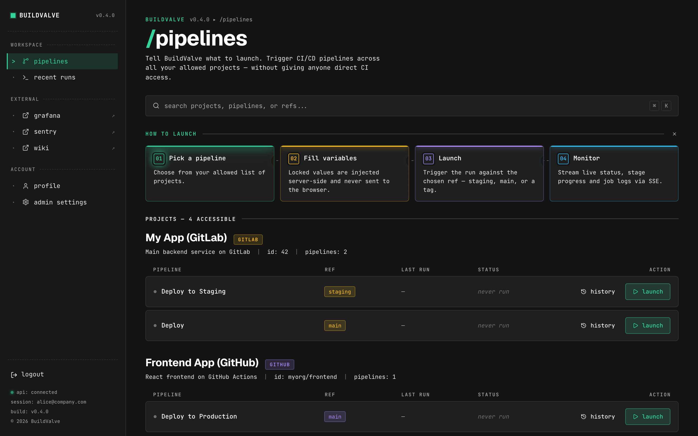

# BuildValve

**A self-hosted, team-friendly CI/CD pipeline launcher.**



BuildValve gives your team a simple dashboard of big "Launch" buttons for their
CI/CD pipelines across **GitLab**, **GitHub Actions**, and **CircleCI** — without
handing out direct access to the CI provider, exposing raw CI variables, or making
everyone learn each provider's UI. You configure which pipelines are available and
who can trigger them; your team logs in and clicks **Launch**.

## Quick start

This example wires up a **GitHub Actions** pipeline with a simple
**username/password** login, and runs everything in one Docker container.

**1. Create a `config.yml`:**

```yaml
ci_providers:
  - name: github
    type: github-actions
    github_token: ghp_xxxxxxxxxxxx          # token with access to trigger the workflow

auth:
  providers:
    - type: local
      enabled: true
      label: "Sign in"
      users:
        - email: alice@example.com
          # SHA-256 hex of the password (plain text is not accepted). Generate with:
          #   echo -n "your-password" | shasum -a 256
          password_sha256: "5e884898da28047151d0e56f8dc6292773603d0d6aabbdd62a11ef721d1542d8"

session:
  secret: change-this-to-a-long-random-string

permissions:
  - users: [alice@example.com]
    projects: [my-app]

projects:
  - id: my-app
    name: "My App"
    provider: github
    external_id: myorg/my-app               # owner/repo
    pipelines:
      - name: "Deploy"
        ref: main
        workflow_id: deploy.yml             # .github/workflows/deploy.yml (needs workflow_dispatch)
        variables: []
```

**2. Create a `Dockerfile`** that bakes the config into the published image:

```dockerfile
FROM ghcr.io/cergfix/buildvalve:latest
COPY config.yml /app/config/config.yml
```

**3. Build and run:**

```bash
docker build -t my-buildvalve .
docker run -d -p 3000:3000 my-buildvalve
```

Open **http://localhost:3000** and sign in as `alice@example.com`.
